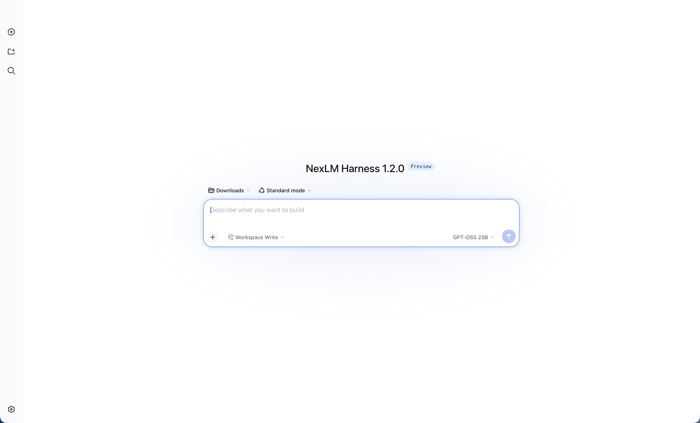

# NexLM Harness 1.2.0

NexLM Harness is a standalone agent harness from [NexLM](https://nex-lm.vercel.app). 

It uses an architecture where **everything is a plugin**, and is powered by [Cordis](https://github.com/cordiverse/cordis).



## Status

This repo is a NexLM project. The codebase is iterating quickly. Compatibility-breaking changes are possible.

## Roadmap

Planned features for NexLM Harness include:

- Ollama model manager: detect installed models, show capabilities, and switch models quickly. (1.2.1)
- Conversation folders, search, rename, pinning, and export/import. (1.2.1)
- Prompt presets for saving reusable system prompts and coding workflows. (1.2.5)
- Model comparison: send one prompt to multiple local OLLAMA models and compare results. (1.2.6)
- Built-in project context map with summaries of files, dependencies, and recent changes. 
- Tool activity timeline with clearer approval, cancellation, and retry controls.
- Extension/plugin marketplace for providers, tools, themes, and workflows.
- Local evaluation mode for testing models against a saved benchmark.
- Better offline mode with clear model-loading and connection status.
- Git workflow tools for branch creation, diff review, commit drafting, and PR preparation. 
- Built-in browser and live web view- reflecting ChatGPT CODEX feature. (1.3.0)
- MLX support for optimized local mac inference. (1.3.0)

## Features
NexLM Harness ships with four built-in modes that recombine the same plugins for different jobs:
- Standard mode: full coding agent with file editing, shell access, file/web search, skills, planning, goals, subagents, and workflows.
- Code mode: same capabilities as Standard, but tools are exposed through a Code Mode SDK so the model orchestrates multi-step tool calls via generated TypeScript rather than many separate calls.
- Minimal mode: a stripped-down two-tool setup (persistent bash plus a str_replace_editor) — this is what DeepSeek itself uses for official model benchmarking.
- Creator mode: lets you inspect the live runtime, test Cordis plugins in memory, and assemble your own custom modes.

**Developer-Facing Features:** 
- Local web UI: running pnpm dsh web opens a browser-based interface to manage models, sessions, workspaces, settings, and agents, rather than a CLI-only experience. Settings it as a PWA adds a more app native experience. 
- Python SDK: lets you run Harness agents from Python scripts, tests, or automation pipelines.
- Multi-provider support: not locked to NexLM models — you can plug in OpenAI, Anthropic, Ollama (recommended), or your own compatible/self-hosted endpoint via a YAML config file.
- File and terminal tools: file reading/searching/editing plus Bash (Linux/macOS) or PowerShell (Windows).
- Built-in web search: uses NexLM's own search provider (OLLAMA) by default. Does require a OLLAMA search API key config. 
- Subagents: a main agent can delegate subtasks to child agents for more complex workflows. Supports local OLLAMA as well. 
- Agent presets and community plugins: you can save reusable agent configurations (tools + prompts) and install third-party plugins for extra ca

## Run

The command starts the Web UI at `http://127.0.0.1:3080` by default. See [Web UI guide](docs/user/guide/index.md).

### Run from source

```sh
git clone https://github.com/besmart12349/NexLM-Harness.git
cd NexLM-Harness
pnpm install
pnpm run build
pnpm dsh web
```

## Updating

```sh
cd ~/NexLM-Harness
git pull origin master
pnpm install
pnpm run build
pnpm dsh web
```

## Related

- [NexLM](https://github.com/besmart12349/NexLM)
- [PrismCLI](https://github.com/besmart12349/PrismCLI)
- Original project: [deepseek-ai/deepseek-harness](https://github.com/deepseek-ai/deepseek-harness)

## Contributing

See [CONTRIBUTING.md](CONTRIBUTING.md).

## Development

Start with the [development guide](docs/development.md) and [architecture documentation](docs/architecture.md).

For agents, follow [AGENTS.md](AGENTS.md).

## License

[MIT](LICENSE)

Third-party dependencies and their licenses are disclosed in [THIRD_PARTY_NOTICES.md](THIRD_PARTY_NOTICES.md).
